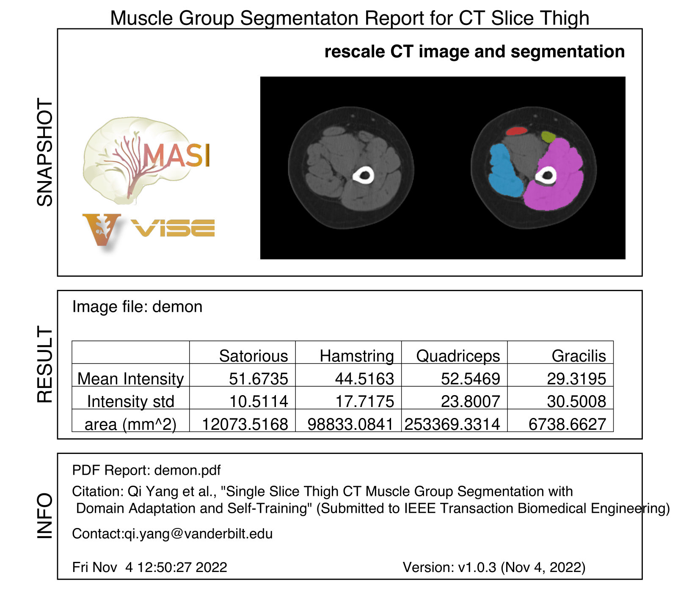

**Single Slice Thigh CT Muscle Group Segmentation with Domain Adaptation and Self-Training**
---
#### Copyright
The contents covered by this repository, including code and pretrained models in the docker container, are free for noncommercial usage (CC BY-NC 4.0). Please check the LICENSE.md file for more details of the copyright information.

---
#### Citation

Qi Yang, Xin Yu, Ho Hin Lee, Leon Y. Cai,  Kaiwen Xu, Shunxing Bao, Yuankai Huo, Ann Zenobia Moore, Sokratis Makrogiannis, Luigi Ferrucci, Bennett A. Landman, “Single Slice Thigh CT Muscle Group Segmentation with Domain Adaptation and Self-Training", IEEE Transactions on Biomedical Engineering (prepare to submit)

---
#### Quick start

- Please download the singularity from this [link](https://drive.google.com/file/d/1xtJf6VpSDyrwb25DSdbo331_Mh6ZouPM/view?usp=share_link)
- Prepare the data used for the singularity.
  - The data should have image dimensions 256 x 256 pixels
  - The data only include left/right mid-thigh image. Please check the paper for reference.
  - The data should be saved in .nii.gz
  - There is no restriction for the name of input data
  - Currently we only support GPU.
- Refer to following code snippets to prepare INPUTS and OUTPUTS directory and inference the muscle group segmentation in .
```
INPUTS=${HOME}/INPUTS
OUTPUTS=${HOME}/OUTPUTS
singularity_file=/path/to/download/singularity/file
mkdir ${INPUTS} ${OUTPUTS}
singularity run --contain --nv --bind ${INPUTS}:/INPUTS --bind ${OUTPUTS}:/OUTPUTS $singularity_file
```
---
##### The output structure
```
├── demon
│   ├── demon_muscle_group.nii.gz
│   ├── demon.nii.gz
│   ├── demon.pdf
│   └── demon.png
└── test_opt.txt
```

**demon_muscle_group.nii.gz**: the segmentation map from the model
**demon.nii.gz**: the original input file
**demon.png**: the visualization used in demon.pdf
**test_opt.txt**: the test option used in the inference stage
**demon.pdf**: the pdf report includes the visualization of final results and stats calculated based on segmentation map. Below is the screenshot of the pdf 


##### Disclaimer
The code and data of this repository are provided to promote reproducible research. They are not intended for clinical care or commercial use.

The software is provided "as is", without warranty of any kind, express or implied, including but not limited to the warranties of merchantability, fitness for a particular purpose and noninfringement. In no event shall the authors or copyright holders be liable for any claim, damages or other liability, whether in an action of contract, tort or otherwise, arising from, out of or in connection with the software or the use or other dealings in the software.